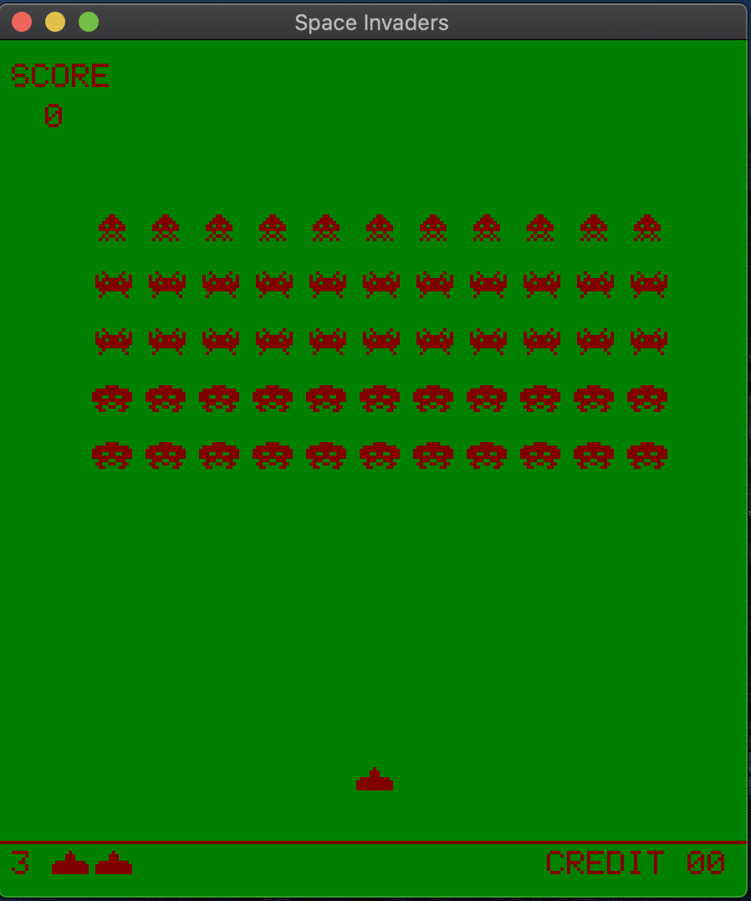
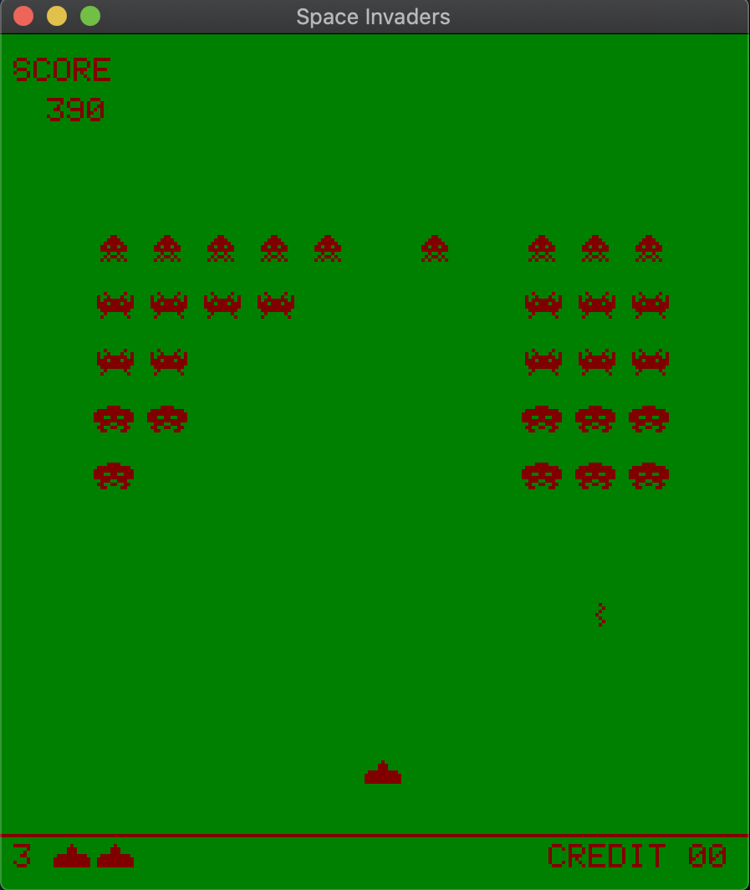
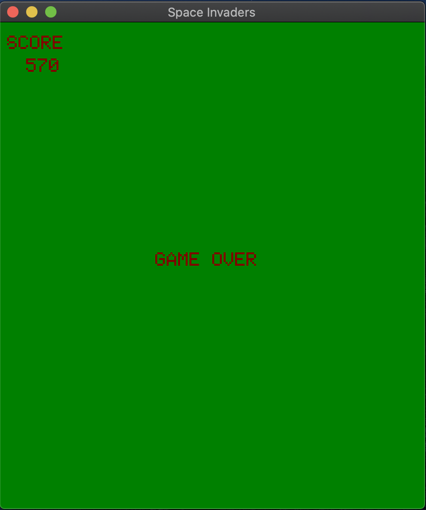

# Space Invaders

A simple OpenGL-based Space Invaders game.

For simplicity and lack of resources, CPU rendering is used.

Environment:

    - C++14
    - g++ compiler

Dependencies:

    - glew
    - glfw3

To install dependencies:

    - MacOS:
        - brew install glfw3
        - brew install glew
    - Ubuntu:
        - sudo apt-get install libglfw3 / sudo apt-get install libglfw3-dev
        - sudo apt-get install libglew-dev

To compile:

>make

Play:

><kbd>Left</kbd> slide left, <kbd>Right</kbd> slide right and <kbd>Space</kbd> for fire lasers.

There are 6 alien types and 1 player type added under <shapes.h>. Please, feel free to update shapes and enjoy.

You can change window size by changing values <buffer_width> and <buffer_height> in "main" function.

## Acknowledgements

I want to give special thanks to Nick Tasios and his great tutorial [here](http://nicktasios.nl/posts/space-invaders-from-scratch-part-1.html)
